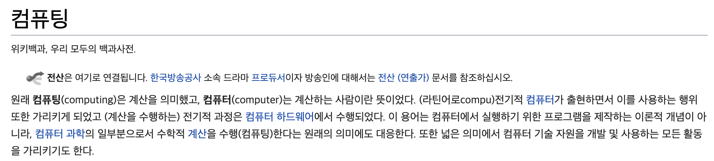

# 클라우드 컴퓨팅 (Cloud Computing)

 

## 클라우드

> 클라우드에 대한 정의가 모호할 수 있지만 기본적으로, 각각 고유한 기능을 가진 서버의 `글로벌 네트워크`를 설명하는 데 사용되는 용어입니다. 클라우드는 실제 엔터티가 아니지만 함께 연결되어 하나의 에코시스템으로 작동하게 되어 있는 전 세계에 분산된 원격 서버의 광대한 네트워크입니다. 
>
> 이러한 서버는 데이터 저장 및 관리, 응용 프로그램 실행 또는 스트리밍 비디오, 웹 메일, 오피스 생산성 소프트웨어 또는 소셜 미디어와 같은 콘텐츠 또는 서비스를 제공하도록 설계되었습니다. 로컬 또는 개인용 컴퓨터에서 파일 및 데이터에 액세스하는 대신 `인터넷 지원 장치에서 온라인으로 액세스`하므로 언제 어디에서나 필요한 정보를 사용할 수 있습니다.
>
> \- [Azure](https://azure.microsoft.com/ko-kr/overview/what-is-the-cloud/) -

 

## 클라우드 컴퓨팅

> **컴퓨팅 (Computing)**
>
> 넓은 의미에서 `컴퓨터 기술 자원을 개발 및 사용하는 모든 활동`을 가리키기도 한다.
>
> 
>
> \- [위키백과]([https://ko.wikipedia.org/wiki/%EC%BB%B4%ED%93%A8%ED%8C%85](https://ko.wikipedia.org/wiki/컴퓨팅)) \-

> **클라우드 컴퓨팅**
>
> 클라우드(인터넷)를 통해 가상화된 컴퓨터의 `시스템 리소스(IT 리소스)`를 제공하는 것이다. 인터넷 기반 컴퓨팅의 일종으로 정보를 자신의 컴퓨터가 아닌 클라우드(인터넷)에 연결된 다른 컴퓨터로 처리하는 기술을 의미한다.
>
> \- [위키백과]([https://ko.wikipedia.org/wiki/%ED%81%B4%EB%9D%BC%EC%9A%B0%EB%93%9C_%EC%BB%B4%ED%93%A8%ED%8C%85](https://ko.wikipedia.org/wiki/클라우드_컴퓨팅)) -

 

## AWS의 클라우드 컴퓨팅 서비스

클라우드 컴퓨팅이란 인터넷에서 종량 요금제(사용한만큼 지불) 방식으로 클라우드 서비스 플랫폼을 통해 컴퓨팅 파워, 데이터베이스 스토리지, 애플리케이션, 기타 IT 리소스를 `온디맨드(공급이 아닌 수요가 모든 것을 결정하는 시스템 or 전략)`로 제공하는 서비스를 말한다.

클라우드 서비스 플랫폼을 사용하면 유연하고 비용이 적게 드는 IT 리소스에 빠른 속도로 액세스 할 수 있다. 클라우드 컴퓨팅을 사용하면 하드웨어에 막대한 사전 투자를 하거나 하드웨어를 유지 관리하기 위해 많은 시간을 할애하지 않아도 된다.

 

## 클라우드 컴퓨팅의 이점

### 1. 자본 비용을 가변 비용으로 대체

> 컴퓨팅 리소스를 사용할 때만 요금을 내고 `사용한 양에 대해서만 지불`할 수 있다.

### 2. 규모의 경제로 얻게 되는 이점

> 수십만 고객의 사용량이 클라우드에 합산되므로 AWS와 같은 공급자는 더 높은 규모의 경제를 달성할 수 있고, 이는 종량제 요금이 더 낮아지는 효과로 이어진다.

### 3. 용량 추정 불필요

> 필요한 인프라 용량을 추정할 필요가 없다. 애플리케이션을 배포하기 전에 용량을 결정하면 고가의 리소스를 구입하여 `유휴`(쓰지 않고 놀림) 상태로 두거나 `한정된 용량`으로 작업하게 되는 경우가 자주 발생한다.
>
> 필요에 따라 많거나 적은 용량을 사용하다가 원할 때에 언제든 `확장 및 축소`를 할 수 있다.

### 4. 속도 및 민첩성 개선

> 클라우드 컴퓨팅 환경에서는 새로운 IT 리소스를 클릭 몇 번만으로 확보할 수 있다. 실험 및 개발에 드는 비용이 절감되고 시간이 단축되므로 조직의 민첩성이 크게 향상된다.

### 5. 데이터 센터 운영 및 유지 관리에 비용 투자 불필요

> 인프라가 아니라 비즈니스에 집중할 수 있다. 

### 6. 몇 분만에 전 지역으로 확대됨

> 클릭 몇 번으로 세계 곳곳의 여러 리전에 애플리케이션을 손쉽게 배포할 수 있다. 지연 시간을 줄이고 최소 비용으로 고객에게 더 나은 사용 환경을 제공할 수 있다.
