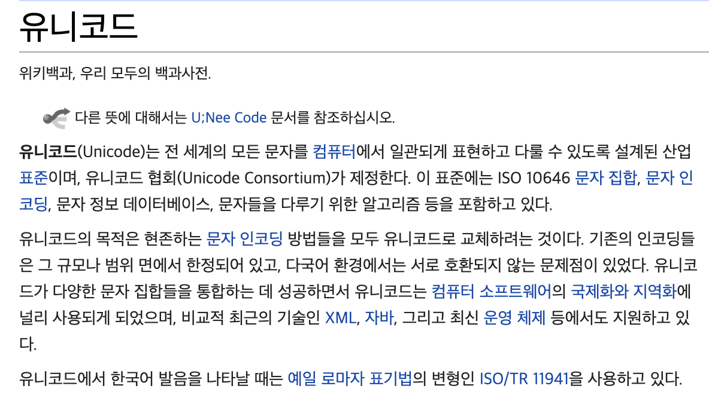

## 인코딩

|문자|아스키 코드|
|:--:|:---:|
|...|...|
|A|65|
|B|66|
|C|67|
|...|...|

컴퓨터는 숫자밖에 모르기 때문에 문자가 숫자로 변환되어 저장된다. 이때 `유니코드`를 기준으로 인코딩과 디코딩을 한다.

- 인코딩 : 문자를 코드로 변환하는 것
- 디코딩 : 코드를 문자로 변환하는 것

문자를 저장할 때는 인코딩을 해서 숫자로 변환해서 저장한다. 저장된 문자를 읽어올 때는 디코딩을 해서 숫자를 원래의 문자로 되돌려야 한다.

### 유니코드 (Unicode)

전 세계의 모든 문자를 하나의 통일된 문자 집합으로 표현하고자 제정된 규칙.

위키 정의

유니코드에 포함시키고자 하는 문자들의 집합을 정의하였는데, 이것을 유니코드 문자 셋(또는 캐릭터 셋, character set)이라고 한다. 그리고 이 문자 셋에 번호를 붙인 것이 유니코드 인코딩이다. 유니코드 인코딩에는 UTF-8, UTF-16, UTF-32 등 여러 가지 종류가 있고, 자바에서는 UTF-16을 사용한다. `UTF-16은 모든 문자를 2 byte 고정크기`로 표현, `UTF-8은 하나의 문자를 1~4 byte의 가변 크기`로 표현한다.

UTF-16은 모든 문자 크기가 동일하기 때문에 다루기 편리하다. 하지만 영어와 숫자가 2 byte로 표현되므로 문서의 크기가 불필요하게 커진다.
 
UTF-8은 영문과 숫자는 2 byte, 한글은 3 byte로 표현하기 때문에 문서의 크기가 작지만, 문자의 크기가 가변적이므로 다루기 어렵다.
 
인터넷에서는 전송 속도가 중요하므로, 문서의 크기가 작을수록 유리하다.

### 아스키 (ASCII)

ASCII (American Standard Code for Information Interchange)
 
정보 교환을 위한 미국 표준 코드란 뜻이다. 아스키는 128개(2^7)의 문자 집합(character set)을 제공하는 7 bit 부호이다.
 
처음 32개의 문자는 인쇄와 전송 제어용으로 사용되는 제어문자(control character)로 출력할 수 없고, 마지막 문자(DEL)를 제외한 33번째 이후의 문자들은 출력할 수 있는 문자들로, 기호와 숫자, 영대소문자로 이루어져 있다.

### 확장 아스키 (Extended ASCII)

일반적으로 데이터는 byte 단위로 다뤄지는데 아스키는 7 bit이므로 1 bit가 남는다. 이 남는 공간을 활용해서 문자를 추가로 정의한 것이 확장 아스키이다. 확장 아스키에 추가된 128개의 문자는 여러 국가와 기업에서 서로의 필요에 따라 다르게 정의해서 사용한다.