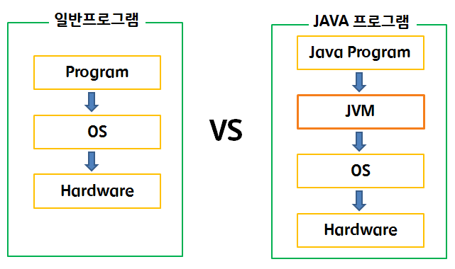

# Chapter 01. 자바를 시작하기 전에


## 1. 자바 (Java Programming Language)

### 1.1 자바란

자바는 썬 마이크로시스템즈에서 개발하여 1996년 1월에 공식적으로 발표한 `객체지향 프로그래밍 언어`이다.

자바의 가장 큰 특징은 `운영체제에 독립적`이라는 것이다. 자바로 작성된 프로그램은 운영체제의 종류에 관계없이 실행 가능하다.

C++의 장점을 채택하는 동시에 잘 사용되지 않는 부분은 제외. 풍부한 클래스 라이브러리(API) 제공.

2010년에 썬이 오라클에 인수되면서 이제 자바는 오라클의 제품이 되었다.

### 1.2 자바의 역사

자바의 역사는 1991년에 썬의 엔지니어들에 의해서 고안된 오크(Oak)라는 언어에서부터 시작되었다.

C++의 장점을 도입하고 단점을 보완한 새로운 언어 개발.

### 1.3 자바 언어의 특징

1. 운영체제에 독립적이다. 
   - 기존의 언어는 하나의 운영체제에 맞게 개발된 프로그램을 다른 종류의 운영체제에 적용하기 위해서는 많은 노력 필요하다.
   - 자바가상머신(JVM)을 통해서 가능. 자바 응용 프로그램은 JVM 하고만 통신.
   - JVM은 운영체제에 종속적. 운영체제에 따라 서로 다른 JVM.
   - `한번 작성하면, 어디서나 실행된다. (Write once, run anywhere`
2. 객체지향언어이다. 
   - 객체지향개념의 특징인 상속, 캡슐화, 다형성이 잘 적용된 순수한 객체지향언어이다.
3. 간결하고 이해하기 쉬운 코드 작성 
   - 자바의 연산자와 기본 구문은 C++에서, 객체지향관련 구문은 스몰톡(smal talk)이라는 객체지향언어에서 가져왔다.
   - 자바의 간결하면서도 명료한 객체지향적 설계는 사용자들이 객체지향 개념을 보다 쉽게 이해하고 활용할 수 있도록 한다.
4. 자동 메모리 관리 (Garbage Collection) 
   - `가비지 컬렉터`가 자동적으로 메모리 관리를 해주기 때문에 메모리를 따로 관리하지 않아도 된다.
   - 프로그래머가 보다 프로그래밍에 집중할 수 있도록 해준다.
5. 네트워크와 분산 처리를 지원한다.
6. 멀티쓰레드를 지원한다. 
   - 자바에서 개발되는 멀티쓰레드 프로그램은 시스템(운영체제)과는 관계없이 구현 가능하다.
   - 여러 쓰레드에 대한 스케줄링을 자바 인터프리터가 담당하게 된다.
7. 동적 로딩을 지원한다. 
   - 실행 시에 모든 클래스가 로딩되지 않고 `필요한 시점에 클래스 로딩`하여 사용.
   - 일부 클래스가 변경되어도 전체 애플리케이션을 다시 컴파일 하지 않아도 된다.

[참고] 자바의 단점으로는 속도 문제가 있었다. 하지만 바이트 코드를 하드웨어의 기계어로 바로 변환 해주는 JIT 컴파일러와 Hotspot과 같은 신기술의 도입으로 성능 문제 개선.

### 1.4 JVM (Java Virtual Machine)

자바를 실행하기 위한 가상 기계(컴퓨터). 자바 애플리케이션이 실행되기 위해서는 반드시 JVM이 필요하다.



Java 애플리케이션은 하드웨어에 맞게 완전히 컴파일된 상태가 아니고 `실행 시에 해석(interpret)`되기 때문에 속도가 느리다는 단점을 가지고 있다.  (JIT 컴파일러와 최신 기술로 속도 문제 많이 개선됨)

Java 애플리케이션은 JVM 하고만 상호작용 하기 때문에 OS와 하드웨어에 독립적이다. 단, JVM은 `OS 종속적`이기 때문에 해당 OS에서 실행 가능한 JVM이 필요하다.

## 2. 자바개발환경 구축하기

### 2.1 자바 개발도구(JDK) 설치하기

자바로 프로그래밍을 하기 위해서는 JDK(Java Development Kit)을 설치해야 한다. JDK를 설치하면 JVM과 Java API(자바 클래스 라이브러리) 외에 자바를 개발하는데 필요한 프로그램들이 설치된다.

JDK의 bin 디렉토리에 있는 주요 실행파일

- javac.exe — 자바 컴파일러. 자바 소스 코드를 바이트 코드로 컴파일 한다.
- java.exe — 자바 인터프리터. 컴파일러가 생성한 바이트 코드를 해석하고 실행한다.
- javap.exe — 역어셈블러. 컴파일된 클래스 파일을 원래의 소스로 변환한다.
- javadoc.exe — 자동 문서 생성기.
- jar.exe — 압축 프로그램.

[참고] JDK 와 JRE

- JDK — 자바 개발 도구
- JRE — 자바 실행 환경(Java Runtime Environment). 자바로 작성된 응용프로그램이 실행되기 위한 최소 환경.
- JDK = JRE + 개발에 필요한 실행파일(javac.exe 등)
- JRE = JVM + 클래스 라이브러리(Java API)

## 3. 자바로 프로그램 작성하기

### 3.1 Hello.java

```
Hello.java 작성 ==javac.exe(컴파일)==> Hello.class 생성 ==java.exe(실행)==> "Hello, World." 출력
```

하나의 Java 애플리케이션에는 main 메서드를 포함한 클래스가 반드시 있어야 한다. main 메서드는 Java 애플리케이션의 시작점이다.

## 4. 자바프로그램의 실행 과정

```
java Hello
```

1. 프로그램의 실행에 필요한 클래스(*.class)를 로드한다.
2. 클래스 파일을 검사한다. (파일 형식, 악성 코드 체크)
3. 지정된 클래스(Hello)에서 main(String[] args)를 호출한다.
