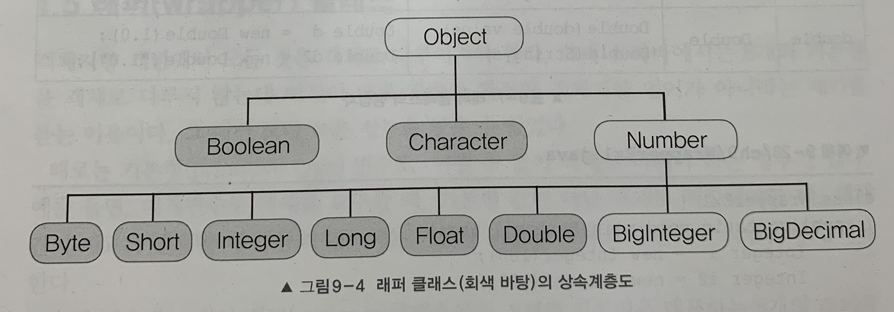

# [자바의 정석] Chapter 09. java.lang 패키지와 유용한 클래스

## 1. Java.lang 패키지

java.lang 패키지는 자바 프로그래밍에 가장 기본이 되는 클래스들을 포함하고 있다. java.lang 패키지의 클래스들은 import 문 없이도 사용할 수 있게 되어 있다.

### 1.1 Object 클래스

Object 클래스는 모든 클래스의 최고 조상이기 때문에 Object 클래스의 멤버들은 모든 클래스에서 바로 사용 가능하다. Object 클래스는 멤버변수는 없고 오직 11개의 메서드만 가지고 있다.

#### equals(Object obj)

매개변수로 객체의 참조 변수를 받아서 비교하여 그 결과를 boolean 값으로 알려주는 역할을 한다.

```java
public boolean equals(Object obj) {
	return (this == obj);
}
```

Object 클래스로부터 상속 받은 equals 메서드는 두 참조 변수에 저장된 값(주소값)이 같은지를 판단하는 기능밖에 할 수 없다.

String 클래스는 Object 클래스의 equals 메서드를 `오버라이딩` 해서 String 인스턴스가 갖는 문자열 값을 비교하도록 되어있다.

String 클래스뿐 아니라 Date, File, Wrapper 클래스(Integer, Double 등)의 equals 메서드도 주소값이 아닌 내용을 비교하도록 오버라이딩 되어 있다. StringBuffer 클래스는 오버라이딩 되어 있지 않다.

#### hashCode()

해싱(hashing) 기법에 사용되는 해시 함수(hash function)를 구현한 것이다. 해싱은 데이터 관리 기법 중의 하나인데, 다량의 데이터를 저장하고 검색하는 데 유용하다.

해시 함수는 찾고자 하는 값을 입력하면, 그 값이 저장된 위치를 알려주는 해시 코드(hash code)를 반환한다. Object 클래스에 정의된 hashCode 메서드는 `객체의 주소값을 이용해서 해시 코드를 만들어 반환하기 때문에 서로 다른 두 객체는 결코 같은 해시 코드를 가질 수 없다`.

```java 
// 객체의 주소값으로 해시 코드 생성
System.identityHashCode(Object x)
```

#### toString()

인스턴스에 대한 정보를 문자열(String)로 제공할 목적으로 정의된 메서드이다.

인스턴스의 정보를 제공한다는 것은 대부분 인스턴스 변수에 저장된 값들을 문자열로 표현한다는 것이다.

```java
public String toString() {
	return getClass.getName()+"@"+Integer.toHexString(hashCode());
}
```

#### clone()

자신을 복제하여 새로운 인스턴스 생성.

얕은 복사(실제 인스턴스의 주소는 같다.)만 이루어진다. 복제된 인스턴스의 작업이 원래의 인스턴스에 영향을 미치게 된다.

```java 
class Point implements Cloneable {
	int x, y;

	Point(int x, int y) {
		this.x = x;
		this.y = y;
	}

	public String toString() {
		return "x=" + x + ", y=" + y;
	}

	public Object clone() {
		Object obj = null;
		try {
			obj = super.clone();  // clone은 받드시 예외처리를 해주어야 한다.
		} catch (CloneNotSupportedException e) {}
		return obj;
	}
}
```

clone()을 사용하려면 복제할 클래스가 Cloneable 인터페이스를 구현해야 하고, clone()을 오버라이딩 하면서 접근 제어자를 protected에서 public으로 변경해야 한다.

Cloneable 인터페이스를 구현한 클래스의 인스턴스만 clone()을 통한 복제가 가능한데, 그 이유는 `인스턴스의 데이터를 보호`하기 위해서이다. Cloneable 인터페이스가 구현되어 있다는 것은 클래스 작성자가 복제를 허용한다는 의미이다.

#### 공변 반환타입

Java 5부터 공변 반환타입(covariant return type)이라는 것이 추가되었는데, 이 기능은 `오버라이딩 할 때, 조상 메서드의 반환 타입을 자손 클래스의 타입으로 변경을 허용`하는 것이다.

```java
public Point clone() {  // 반환 타입을 Object에서 Point로 변경
	Object obj = null;

	try {
		obj = super.clone();
	} catch (CloneNotSupportedException e) {}
	return (Point)obj;  // Point 타입으로 형변환한다.
}
```

공변 반환타입을 사용하면 조상 타입이 아닌 실제로 반환되는 자손 객체의 타입으로 반환할 수 있어 `번거로운 형변환이 줄어든다` 는 장점이 있다.

```java
Point copy = (Point) original.clone() ==> Point copy = original.clone();

// 배열 복사 방법 1
int[] arr = {1, 2, 3, 4, 5};
int[] arrClone = arr.clone();

// 배열 복사 방법 2 
int[] arr = {1, 2, 3, 4, 5};
int[] arrClone = new int[arr.length];  // 배열을 생성하고
System.arraycopy(arr, 0, arrClone, 0, arr.length);  // 내용을 복사한다.
```

#### 얕은 복사와 깊은 복사

clone()은 단순히 객체에 저장된 값을 그대로 복제할 뿐, 객체가 참조하고 있는 객체까지 복제하지는 않는다.

- **얕은 복사** — 원본과 복제본이 같은 객체를 공유
- **깊은 복사** — 원본이 참조하고 있는 객체까지 복사. 원본과 복사본이 서로 다른 객체를 참조. 원본의 변경이 복사본에 영향을 미치지 않는다.


#### 💡getClass()

자신이 속한 클래스의 Class 객체를 반환하는 메서드이다.

```java
public final class Class implements ... {  // Class 클래스
	// ...
}
```

Class 객체는 클래스의 모든 정보를 담고 있으며, 클래스 당 1개만 존재한다. `클래스 파일이 클래스 로더(ClassLoader)에 의해서 메모리에 올라갈 때 자동으로 생성`된다.

`클래스 로더는 실행 시에 필요한 클래스를 동적으로 메모리에 로드하는 역할을 한다.` 먼저 기존에 생성된 클래스 객체가 메모리에 존재하는지 확인하고, 있으면 객체의 참조를 반환하고 없으면 클래스 패스(classpath)에 지정된 경로를 따라서 클래스 파일을 찾는다. 못 찾으면 ClassNotFoundException이 발생하고, 찾으면 클래스 파일을 읽어서 Class 객체로 반환한다.

파일 형태로 저장되어 있는 클래스를 읽어서 Class 클래스에 정의된 형식으로 변환하는 것이다. 즉, `클래스 파일을 읽어서 사용하기 편한 형태로 저장해 놓은 것이 클래스 객체`이다.

#### Class 객체를 얻는 방법

```java
Class 객체에 대한 참조를 얻는 방법

Class cObj = new Card().getClass();  // 생성된 객체로부터 얻는 방법
Class cObj = Card.class;             // 클래스 리터럴(*.class)로부터 얻는 방법
Class cObj = Class.forName("Card");  // 클래스 이름으로부터 얻는 방법
```

forName()은 특정 클래스 파일, 예를 들어 데이터베이스 드라이버를 메모리에 올릴 때 주로 사용한다.

Class 객체를 이용하면 클래스에 정의된 멤버의 이름이나 개수 등, 클래스에 대한 모든 정보를 얻을 수 있기 때문에 Class 객체를 통해서 객체를 생성하고 메서드를 호출하는 등 보다 `동적인 코드`를 작성할 수 있다.

```java
Card c = new Card();
Card c = Class.class.newInstance();  // Class 객체를 이용해서 객체 생성. newInstance()는 InstantiationException이 발생할 수 있다.
```

reflection API — 동적으로 객체 생성하고 메서드 호출하는 방법

Class 클래스 — 클래스의 정보를 얻을 수 있는 많은 수의 메서드 정의되어 있다.

### 1.2 String 클래스

기존의 다른 언어에서는 문자열을 char 형의 배열로 다루었으나 자바에서는 문자열을 위한 클래스를 제공한다. String은 문자열을 저장하고 다루는데 필요한 메서드를 제공한다.

#### 변경 불가능한(immutable) 클래스

String 클래스에서는 문자열을 저장하기 위해서 문자형 배열 변수(char[]) value를 인스턴스 변수로 저장해놓고 있다.

```java
public final class String implements Serializable, Comparable {
	private char[] value;

	// ...
}
```

한번 생성된 String 인스턴스가 갖고 있는 문자열은 읽어 올 수만 있고, 변경할 수는 없다.

'+' 연산자를 이용해서 문자열을 결합하는 경우 `인스턴스 내의 문자열이 바뀌는 것이 아니라 새로운 문자열("ab")이 담긴 String 인스턴스가 생성`되는 것이다.


덧셈 연산자 '+'를 사용해서 문자열을 결합하는 것은 `매 연산 시 마다 새로운 문자열을 가진 String 인스턴스가 생성되어 메모리 공간을 차지`하게 되므로 가능한 한 결합 횟수를 줄이는 것이 좋다.

#### 문자열의 비교

```java
문자열의 만드는 방법

// i. 문자열 리터럴을 지정하는 방법
String str1 = "abc";  // 문자열 리터럴 "abc"의 주소가 str1에 저장됨

// ii. String 클래스의 생성자를 이용해서 만드는 방법
String str2 = new String("abc");  // 새로운 String 인스턴스를 생성
```

문자열 리터럴은 `이미 존재하는 인스턴스를 재사용`한다. (문자열 리터럴은 클래스가 메모리에 로드될 때 자동적으로 미리 생성된다.)

String 클래스의 생성자를 이용한 경우에는 `new 연산자에 의해서 메모리 할당이 이루어지기 때문에 항상 새로운 String 인스턴스가 생성`된다.


<왼쪽 : 인스턴스 재사용, 오른쪽 : 새로운 인스턴스 생성>

equals()를 사용했을 때는 두 `문자열의 내용을 비교`

등가비교연산자 '=='로 비교했을 때는 `인스턴스의 주소를 비교`

```java
// 문자열 리터럴
str1 == str2;  // true. 같은 인스턴스
str1.equals(str2);  // true

// String 인스턴스
str3 = new String("abc");
str4 = new String("abc");
str3 == str4;  // false. 다른 인스턴스
str3.equals(str4);  // true
```

#### 문자열 리터럴

자바 소스 파일에 포함된 모든 문자열 리터럴은 컴파일 시에 클래스 파일에 저장된다. 같은 내용의 문자열 리터럴을 한번만 저장된다. 문자열 리터럴도 String 인스턴스이고, `한번 생성하면 내용을 변경할 수 없으니 하나의 인스턴스만 공유`하면 되기 때문이다.

문자열 리터럴이 저장된 클래스 파일이 클래스 로더에 의해 메모리에 올라갈 때, 이 리터럴의 목록에 있는 리터럴들이 JVM 내에 있는 `상수 저장소(constant pool)`에 저장된다.

#### 빈 문자열(empty string)

길이가 0인 배열 존재 가능.

```java
String s = "";

내부적으로는 new char[0]과 같이 길이가 0인 char형 배열 저장하고 있다.

char c = '';  // 불가능하다.

자바에서 String과 char 형의 초기화
String s = "";  // 빈 문자열로 초기화
char c = ' ';  // 공백으로 초기화
```

#### join()과 StringJoiner

join()은 여러 문자열 사이에 구분자를 넣어서 결합한다. split()과 반대

```java
String animal = "dog,cat,bear";
String[] arr = animal.split(",");
String str = String.join("0", arr);
System.out.println(str);  // dog-cat-bear
```

java.util.StringJoiner 클래스

```java
StringJoiner sj = new StringJoiner(",", "[", "]");
String[] strArr = [ "aaa", "bbb", "ccc" ];

for (String s : strArr) {
	sj.add(s.toUpperCase());
}

System.out.println(sj.toString());  // [AAA,BBB,CCC]
```

### 1.3 StringBuffer 클래스와 StringBuilder 클래스

String 클래스는 인스턴스를 생성할 때 지정된 문자열을 변경할 수 없지만 `StringBuffer 클래스는 변경이 가능하다`.

```java
public final class StringBuffer implements java.io.Serializable {
	private char[] value;
	// ...
}
```

#### StringBuffer 생성자

StringBuffer 클래스의 인스턴스를 생성할 때, 적절한 길이의 char형 배열이 생성되고, 이 배열은 문자열을 저장하고 편집하기 위한 `공간(buffer)`으로 사용된다.

StringBuffer(int length) 를 사용해서 StringBuffer 인스턴스에 저장될 문자열의 길이를 고려하여 충분히 여유있는 크기로 지정하는 것이 좋다. `버퍼의 크기를 지정해주지 않으면 16개의 문자를 저장할 수 있는 크기의 버퍼`를 생성한다.

```java
public StringBuffer(int length) {
	value = new char[length];
	shared = false;
}

public StringBuffer() {
	this(16);  // 버퍼의 크기를 지정하지 않으면 버퍼의 크기는 16이 된다.
}

public StringBuffer(String str) {
	this(str.length() + 16);  // 지정한 문자열의 길이보다 16이 더 크게 버퍼를 생성한다.
	append(str);
}
```

버퍼의 크기가 작업하려는 문자열의 길이보다 작을 때는 `내부적으로 버퍼의 크기를 증가시키는 작업이 수행`된다.

#### StringBuffer 비교

StringBuffer 클래스는 `equals 메서드를 오버라이딩 하지 않아서` StringBuffer 클래스의 equals 메서드를 사용해도 등가비교연산자(==)로 비교한 것과 같은 결과를 얻는다.

```java
StringBuffer sb = new StringBuffer("abc");
StringBuffer sb2 = new StringBuffer("abc");

sb == sb2; ==> false
sb.equals(sb2); ==> false

StringBuffer 클래스의 문자열 비교 방법

String s = sb.toString();
String s2 = sb2.toString();

s.equals(s2);  ==> true
```

#### StringBuilder 란

StringBuffer는 멀티스레드에 안전(thread safe)하도록 동기화 되어 있다. 멀티스레드로 작성된 프로그램이 아닌 경우, StringBuffer의 동기화는 불필요하게 성능만 떨어뜨리게 된다.

StringBuilder는 StringBuffer에서 스레드의 동기화만 뺀 클래스이다. StringBuilder와 StringBuffer는 완전히 똑같은 기능으로 작성되어 있다.

### 1.4 Math 클래스

Math 클래스는 기본적인 수학 계산에 유용한 메서드로 구성되어 있다.

Math 클래스의 생성자는 접근제어자가 모두 private이기 때문에 다른 클래스에서 Math 인스턴스 생성할 수 없다. Math 클래스 내에 인스턴스 변수가 하나도 없어서 인스턴스를 생성할 필요가 없기 때문. 메서드 모두 static

- round() — 소수점 첫 째 자리에서 반올림
- rint() — 소수점 첫 째 자리에서 반올림. 반환값이 double. `음수일 때, 소수점 첫 째 자리가 5 미만일 때 반올림한다.` 주어진 double 값과 가장 가까운 정수값을 double형으로 반환한다.
- ceil() — 올림 (-1.5를 올림하면 -1.0이 된다)
- floor() — 버림. (-1.5를 버림하면 -2.0이 된다)

#### 예외를 발생시키는 메서드

메서드에 'Exact'가 포함된 메서드들은 정수형 간의 연산에서 발생할 수 있는 오버플로우(overflow)를 감지하기 위한 것이다.

#### 삼각함수와 지수, 로그

- sqrt() — 제곱근 계산
- pow() — n제곱 계산

#### StrictMath 클래스

Math 클래스는 최대한의 성능을 내기 위해 JVM이 설치된 OS의 메서드를 호출해서 사용한다. OS에 의존적인 계산을 한다. 컴퓨터마다 결과 다를 수 있다.

어떤 OS에서 실행되어도 항상 같은 결과를 얻도록 Math 클래스를 새로 작성한 것이 StrictMath 클래스이다.

### 1.5 래퍼(wrapper) 클래스

래퍼 클래스를 이용해 8개의 기본형을 객체로 다룰 수 있다.

```java
public final class Integer extends Number implements Comparable {
	...
	private int value;
	...
}
```

언제 쓰는가 ?

- 매개변수로 객체를 요구하는 경우, 기본형 값이 아닌 객체로 저장할 때, 객체 간의 비교가 필요할 때 등

Integer 객체에 비교연산자 사용할 수 없다. comapreTo() 메서드 제공

```java
A.compareTo(B)

A == B ==> return 0
A < B ==> return -1
A > B ==> return 1
```

Integer.SIZE() — int형 bit

Integer.BYTES() — int형 byte

#### Number 클래스

추상 클래스로 래퍼 클래스들의 조상이다. 기본형 중에서 숫자와 관련된 래퍼 클래스들은 모두 Number 클래스의 자손이다.



#### 문자열을 숫자로 변환하기

```java
int i = new Integer("100").intValue();
int i2 = Integer.parseInt("100");
Integer t3 = Integer.valueOf("100");
```

parseInt()와 valueOf()의 차이는 `반환 타입이 기본형이냐 래퍼 클래스 타입이냐` 이다. `성능은 valueOf()가 조금 더 느리다.` Java 5부터 `오토박싱(autoboxing)` 기능 도입. 반환형 기본형/래퍼 클래스 차이 없다.

```java
다른 진법(radix)의 숫자 변환
static int parseInt(String s, int radix);
static Integer valueOf(String s, int radix);
```
