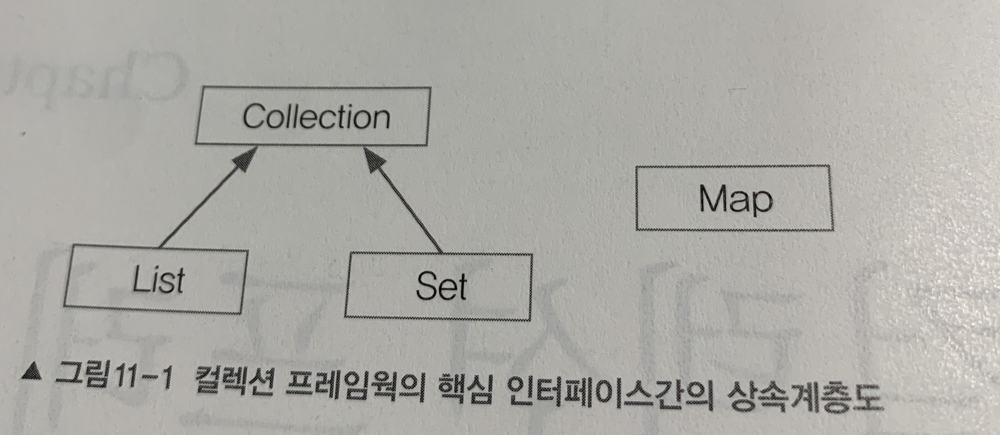
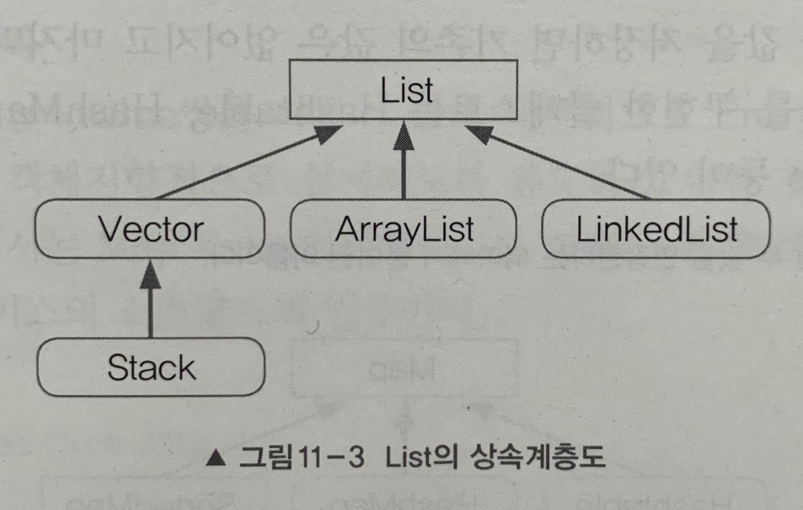
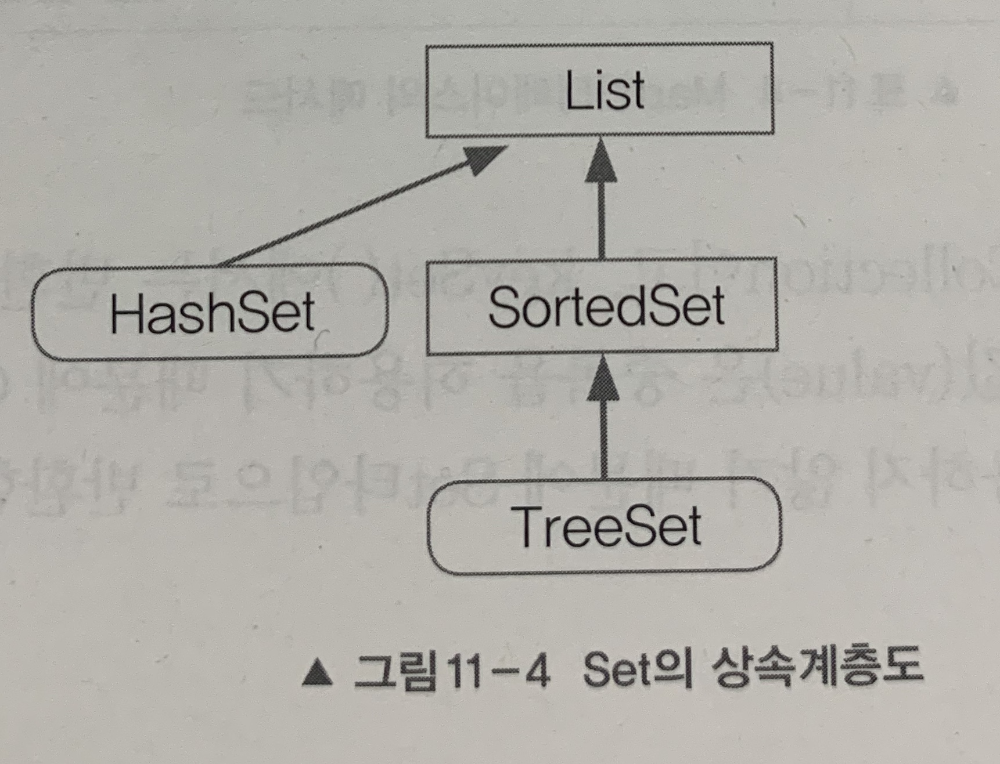
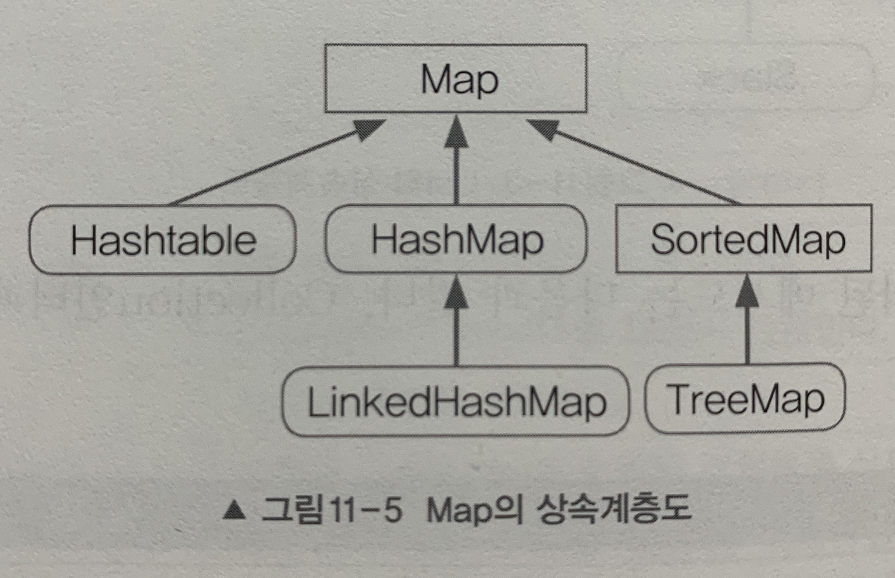
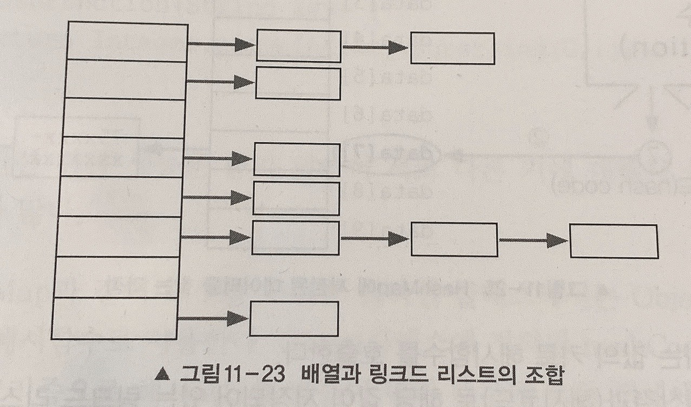
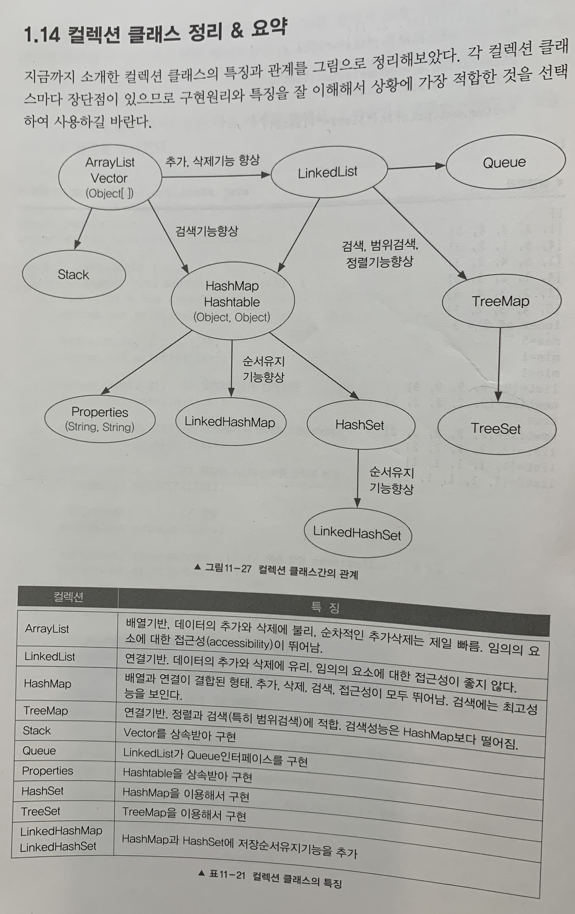

# [자바의 정석] Chapter 11. 컬렉션 프레임워크 (Collections Framework)

## 1. 컬렉션 프레임워크 (Collections Framework)

컬렉션 프레임워크이란 `데이터 군을 저장하는 클래스들을 표준화한 설계`를 뜻한다.

컬렉션(Collection)은 다수의 데이터(데이터의 그룹)

프레임워크는 표준화된 프로그래밍 방식을 의미한다.

```
Java API 문서에서는 컬렉션 프레임워크를 데이터 군(group)을 다루고 표현하기 위한 단일화된 구조라고 정의한다.
```

컬렉션 프레임워크는 다수의 데이터(컬렉션)를 다루는 데 필요한 다양하고 풍부한 클래스들을 제공한다.

### 1.1 컬렉션 프레임워크의 핵심 인터페이스

컬렉션 프레임워크에서는 각 컬렉션을 다루는 데 필요한 기능을 가진 `3개의 인터페이스`를 정의했다.  인터페이스 List와 Set의 공통된 부분을 다시 뽑아서 새로운 인터페이스인 Collection을 추가로 정의했다.



프로그래밍 실력을 어느 정도 갖추게 되었을 때 컬렉션 프레임워크의 실제 소스를 분석해보면 객체지향적인 설계 능력을 향상시키는 데 많은 도움이 될 것이다.

#### 컬렉션 인터페이스

|인터페이스|특징|
|:---:|-----|
|List|순서가 있는 데이터의 집합. 데이터의 중복을 허용한다.<br />구현클래스 : ArrayList, LinkedList, Stack, Vector 등|
|Set|순서를 유지하지 않는 데이터의 집합. 데이터의 중복을 허용하지 않는다.<br />구현클래스 : HashSet, TreeSet 등|
|Map|키(key)와 값(value) 쌍(pair)으로 이루어진 데이터의 집합.<br />순서는 유지되지 않으며, 키는 중복을 허용하지 않고, 값은 중복을 허용한다.<br />구현클래스 : HashMap, TreeMap, HashTable, Properties 등|

Collection 인터페이스는 컬렉션 클래스에 저장된 데이터를 읽고, 추가하고 삭제하는 등 컬렉션을 다루는 데 가장 기본적인 메서드들을 정의하고 있다.

#### List 인터페이스

List 인터페이스는 `중복을 허용`하면서 `저장 순서가 유지`되는 컬렉션을 구현하는 데 사용된다.



#### Set 인터페이스

Set 인터페이스는 `중복을 허용하지 않고` `저장 순서가 유지되지 않는` 컬렉션 클래스를 구현하는 데 사용된다.



#### Map 인터페이스

Map 인터페이스는 `키(key)와 값(value)을 하나의 쌍으로 묶어서 저장`하는 컬렉션 클래스를 구현하는 데 사용된다.

키는 중복될 수 없지만 값은 중복을 허용한다. 기존에 저장된 데이터와 중복된 키와 값을 저장하면 기존의 값은 없어지고 마지막에 저장된 값이 남게 된다.



#### Map.Entry 인터페이스

Map.Entry 인터페이스는 Map 인터페이스의 내부 인터페이스이다.

Map에 저장되어 있는 `key-value 쌍을 다루기 위해` 내부적으로 Entry 인터페이스를 정의해놓았다.

Map 인터페이스를 구현하는 클래스에서는 Map.Entry 인터페이스도 함께 구현해야 한다.

```java
public interface Map {
	...
	interface Entry {
		Object getKey();
		Object getValue();
		Object setValue(Object value);
		boolean equals(Object o);
		int hashCode();
		...
	}
}
```

### 1.2 ArrayList

ArrayList는 기존의 Vector를 개선한 것으로 Vector와 구현 원리와 기능적인 측면에서 동일하다고 할 수 있다. Vector는 기존에 작성된 소스와의 호환성을 위해서 남겨둔 것. ArrayList를 사용하자.

```java
배열에 더 이상 저장할 새로운 공간이 없으면(기본 크기 10) 보다 큰 새로운 배열을 생성해서 기존의 배열에 저장된 내용을 새로운 배열로 복사한 다음에 저장한다.
public class ArrayList extends AbstractList
	implements List, RandomAccess, Cloneable, java.io.Serializable {
		...
		transient Object[] elementData;  // Object 배열
		...
}
```

Collection은 인터페이스이고, Collections는 클래스이다.

```java
List list = new ArrayList(10);  // 크기를 여유 있게 잡는다.
```

ArrayList를 생성할 때, 저장할 요소의 개수를 고려해서 실제 저장할 개수보다 약간 여유 있는 크기로 하는 것이 좋다. 생성할 때 지정한 크기보다 더 많은 객체를 저장하면 자동적으로 크기가 늘어나기는 하지만, 이 과정에서 처리 시간이 많이 소요되기 때문이다.

ArrayList나 Vector 같이 배열을 이용한 자료구조는 `데이터를 읽어오고 저장하는 데는 효율이 좋지만`, `용량을 변경해야 할 때는 새로운 배열을 생성한 후 기존의 배열로부터 새로 생성된 배열로 데이터를 복사`해야 하기 때문에 상당히 `효율이 떨어진다`는 단점을 가지고 있다.

배열에 객체를 순차적으로 저장할 때와 객체를 마지막에 저장된 것부터 삭제하면 System.arrayCopy()를 호출하지 않기 때문에 `작업 시간이 짧지만`, 배열의 중간에 위치한 객체를 추가하거나 삭제하는 경우 System.arrayCopy()를 호출해서 `다른 데이터의 위치를 이동`시켜 줘야 하기 때문에 다루는 `데이터의 개수가 많을수록 작업 시간이 오래 걸린다`.

### 1.3 LinkedList

#### 배열의 장점

- 가장 기본적인 형태의 자료구조로 구조가 간단하며 사용하기 쉽고 `데이터를 읽어오는 데 걸리는 시간(접근 시간, access time)이 가장 빠르다`.

#### 배열의 단점
- 크기를 변경할 수 없다.
  - `크기를 변경할 수 없으므로 새로운 배열을 생성해서 데이터를 복사`해야 한다.
  - 실행 속도를 향상시키기 위해서는 충분히 큰 크기의 배열을 생성해야 하므로 `메모리가 낭비된다`.
- 비순차적인 데이터의 추가 또는 삭제에 시간이 많이 걸린다.
  - 배열의 중간에 데이터를 추가하려면 빈자리를 만들기 위해 다른 데이터들을 복사해서 이동해야 한다.

배열은 데이터가 연속적으로 존재하지만 링크드 리스트는 불연속적으로 존재하는 데이터를 서로 연결(link)한 형태로 구성되어 있다.

`실제로 LinkedList 클래스는 더블 링크드 리스트로 구현되어 있다.` 링크드 리스트의 낮은 접근성(accessibility)을 높이기 위해.

```
= 순차적으로 추가하기 =
ArrayList : 115
LinkedList : 134

= 중간에 추가하기 =
ArrayList : 1364
LinkedList : 15

= 중간에서 삭제 =
ArrayList : 1660
LinkedList : 176

= 순차적으로 삭제하기 =
ArrayList : 8
LinkedList : 20

인덱스가 n인 데이터의 주소 = 배열의 주소 + n * 데이터 타입의 크기
```

#### 비교
|컬렉션|읽기(접근시간)|추가/삭제|비고|
|----|--|--|------|
|ArrayList|빠르다|느리다|순차적인 추가/삭제는 더 빠름.<br />비효율적인 메모리 사용|
|LinkedList|느리다|빠르다|데이터가 많을수록 접근성이 떨어짐|

데이터의 개수가 변하지 않는 경우라면 ArrayList
<br />
데이터 개수의 변경이 잦다면 LinkedList

### 1.4 Stack 과 Queue

#### 스택 (Stack)
- 마지막에 저장한 데이터를 먼저 꺼내게 되는 LIFO(Last In First Out) 구조로 되어 있다.
- ArrayList로 구현하는 것이 적합하다.
- 활용 : undo/redo, 웹브라우저의 뒤로/앞으로, 메소드 호출

#### 큐 (Queue)
- 처음에 저장한 데이터를 가장 먼저 꺼내게 되는 FIFO(First In First Out) 구조로 되어 있다.
- 데이터의 추가/삭제가 쉬운 LinkedList로 구현하는 것이 적합하다.
- 대기 목록
- 버퍼(buffer), 리눅스의 history 명령, 프로그램 최근 사용 목록

#### 우선순위 큐 (Priority Queue)
- Queue 인터페이스의 구현체 중 하나이다.
- 저장한 순서에 관계없이 우선순위가 높은 것부터 꺼낸다.
- null 저장 시 NullPointerException 발생

```
  우선순위는 숫자가 작을수록 높다.
  input [1, 2, 5, 3, 4] output [1, 2, 3, 4, 5]
```

#### 덱 (Deque)
- '디큐'라고도 읽는다.
- 큐와 달리 양쪽 끝에 추가/삭제가 가능하다.
- 구현체로는 ArrayDequeu 와 LinkedList 등이 있다.
- 스택과 큐를 하나로 합쳐놓은 것과 같다.

### 1.5 Iterator, ListIterator, Enumeration

Iterator, ListIterator, Enumeration 모두 컬렉션에 저장된 요소를 접근하는데 사용되는 인터페이스이다. Enumeration은 Iterator의 구버전이며, ListIterator는 Iterator의 기능을 향상시킨 것이다.

#### Iterator

컬렉션 프레임워크에서는 컬렉션에 저장된 요소들을 읽어오는 방법을 표준화하였다. Collection 인터페이스에 Iterator를 반환하는 iterator() 메소드 정의.

```java
public interface Iterator {
	boolean hasNext();
	Object next();
	void remove();
}

public interface Collection {
	...
	public Iterator iterator();
	...
}
```

#### ListIterator와 Enumeration
- Enumeration — 컬렉션 프레임워크가 만들어지기 이전에 사용하던 것으로 Iterator의 구버전이다. Iterator를 사용하자.
- ListIterator — Iterator에 양방향 조회 기능 추가 (List를 구현한 경우에만 사용가능)

### 1.6 Arrays

Arrays 클래스에는 배열을 다루는데 유용한 메서드가 정의되어 있다.

#### 배열의 복사
- copyOf() — 배열 전체 복사
- copyOfRange() — 배열의 일부 복사

### 배열 채우기
- fill() — 배열의 모든 요소를 지정된 값으로 채운다.
- setAll() — 배열을 채우는 데 사용할 함수형 인터페이스를 매개변수로 받는다.

#### 배열의 정렬과 검색
- sort() — 배열 정렬
- binarySearch() — 이진 탐색. 정렬되어 있는 경우만. 중복값 있는 경우 어떤 위치 반환될지 모름

#### 문자열의 비교와 출력
- equals() — 일차원 배열 요소 비교
- deepToEquals() — 다차원 배열 요소 비교
- toString() — 배열의 모든 요수 문자열로 반환
- deepToString() — 다차원 배열의 모든 요소 문자열로 반환

#### 배열을 List로 변환
- asList(Object... a) — 배열을 List로 담아서 반환한다.
- asList()가 반환한 List의 크기를 변경할 수 없다. (추가/삭제 불가능)

### 1.7 Comparator 와 Comparable

Comparator와 Comparable은 모두 인터페이스로 컬렉션을 정렬하는데 필요한 메서드를 정의하고 있다.

#### Comparable
- 기본 정렬 기준을 구현하는데 사용

#### Comparator
- 기본 정렬 기준 외에 다른 기준으로 정렬하고자 할 때 사용

### 1.8 HashSet

HashSet은 Set 인터페이스를 구현한 가장 대표적인 컬렉션. 중복된 요소를 저장하지 않는다.
<br />
저장 순서를 유지하고자 한다면 LinkedHashSet을 사용해야 한다.

두 객체에 대해 equals 메소드를 호출한 결과가 true이면, 두 객체의 해시 코드는 반드시 같아야 하지만, 두 객체의 해시 코드가 같다고 해서 equals 메소드의 호출 결과가 반드시 true 이어야 하는 것은 아니다.

### 1.9 TreeSet

TreeSet은 이진 검색 트리(Binary Search Tree)라는 자료구조의 형태로 데이터를 저장하는 컬렉션 클래스이다. 이진 검색 트리는 정렬, 검색, 범위검색에 높은 성능을 보이는 자료구조이다.

TreeSet은 정렬된 상태를 유지하기 때문에 단일 값 검색과 범위검색 속도가 빠르다.
<br />
링크드 리스트보드 데이터의 추가/삭제가 느리다.
<br />
대신 배열이나 링크드 리스트에 비해 검색과 정렬 기능이 뛰어나다.

```
이전 검색 트리 (Binary Search Tree)
 - 모든 노드는 최대 두 개의 자식 노드를 가질 수 있다.
 - 왼쪽 자식 노드의 값은 부모 노드의 값보다 작고 오른쪽 자식 노드의 값은 부모 노드의 값보다 크다.
 - 노드의 추가/삭제에 시간이 걸린다. (순차적으로 저장하지 않으므로)
 - 검색(범위검색)과 정렬에 유리하다.
 - 중복된 값을 저장하지 않는다.
```

### 1.10 HashMap 과 HashTable

HashTable과 HashMap의 관계는 Vector와 ArrayList의 관계와 같다. HashTable보다 새로운 버전인 HashMap 사용 권장.

HashMap은 Map을 구현했다. Map의 특징인 키(key), 값(value)을 묶어서 하나의 데이터(entry)로 저장한다. 해싱을 사용하기 때문에 많은 양의 데이터를 검색하는데 있어서 뛰어난 성능을 보인다.

키와 값은 서로 관련된 값이기 때문에 하나의 클래스로 정의해서 다룬다. 데이터의 무결성 측면에서 바람직하다.

```
키(key) : 컬렉션 내의 키(key) 중에서 유일해야 한다. 저장된 값을 찾는데 사용
값(value) : 키와 달리 데이터의 중복을 허용해야 한다.
```

#### 해싱과 해시함수

해싱이란 해시함수를 이용해서 데이터를 해시테이블에 저장하고 검색하는 기법을 말한다.
<br />
해싱에서 사용되는 자료구조는 배열과 링크드 리스트의 조합으로 되어 있다.



### 1.11 TreeMap

이진검색트리의 형태로 키와 값의 쌍으로 이루어진 데이터를 저장한다.
<br />
검색과 정렬에 적합하다.
<br />
검색에 관한한 대부분의 경우 HashMap이 TreeMap보다 더 뛰어나다. 범위 검색이나 정렬이 필요한 경우 TreeMap 사용.

### 1.12 Properties

Properties는 HashMap의 구버전인 HashTable을 상속받아 구현한 것이다. HashTable은 키와 값을 (Object, Object) 형태로 저장하는데 비해, Properties는 (String, String) 형태로 저장하는 보다 단순화된 컬렉션 클래스이다.

주로 애플리케이션의 환결설정과 관련된 속성(property)을 저장하는데 사용되며 파일로부터 읽고 쓰는 편리한 기능을 제공한다.

### 1.13 Collections

Collections는 컬렉션과 관련된 메소드를 제공한다.

- 컬렉션의 동기화
   - 멀티 스레드 프로그래밍에서는 데이터의 일관성을 유지하기 위해 공유되는 객체에 동기화가 필요하다.
   - 새로 추가된 ArrayList, HashMap과 같은 컬렉션은 동기화를 자체적으로 처리하지 않고 필요한 경우에만 java.util.Collections 클래스의 동기화 메소드를 이용해 동기화를 처리한다.
- 변경불가 컬렉션 만들기
   - 읽기전용 컬렉션으로 만든다. 주로 멀티 스레드 환경에서 컬렉션 공유 방지하기 위해 사용
- 싱글톤 컬렉션 만들기
   - 인스턴스 개수 생성 제한
- 한 종류의 객체만 저장하는 컬렉션 만들기
   - 지정된 종류의 객체만 저장할 수 있도록 제한

### 정리



### Reference

- [자바의 정석](https://www.aladin.co.kr/shop/wproduct.aspx?ItemId=76083001)