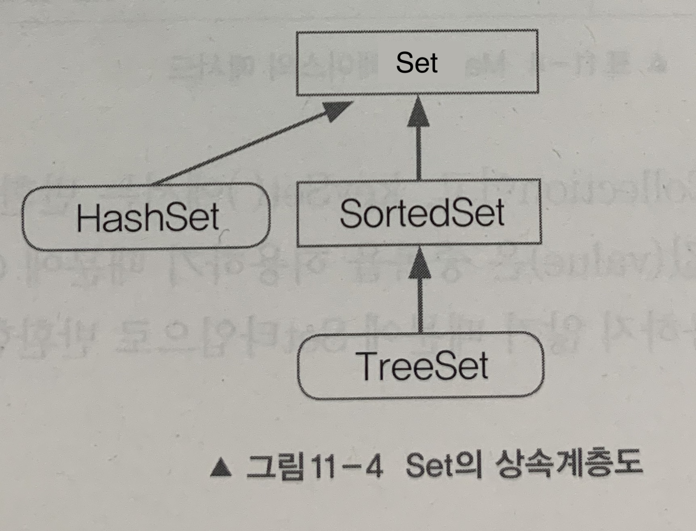

# [자바의 정석] Chapter 11. 컬렉션 프레임웍 (Collections Framework)

## 1. 컬렉션 프레임웍 (Collections Framework)

컬렉션 프레임웍이란 `데이터 군을 저장하는 클래스들을 표준화한 설계`를 뜻한다.

컬렉션(Collection)은 다수의 데이터(데이터의 그룹)

프레임웍은 표준화된 프로그래밍 방식을 의미한다.

```
Java API 문서에서는 컬렉션 프레임웍을 데이터 군(group)을 다루고 표현하기 위한 단일화된 구조라고 정의한다.
```

컬렉션 프레임웍은 컬렉션, 다수의 데이터를 다루는 데 필요한 다양하고 풍부한 클래스들을 제공한다.

### 1.1 컬렉션 프레임웍의 핵심 인터페이스

컬렉션 프레임웍에서는 각 컬렉션을 다루는 데 필요한 기능을 가진 `3개의 인터페이스`를 정의했다.  인터페이스 List와 Set의 공통된 부분을 다시 뽑아서 새로운 인터페이스인 Collection을 추가로 정의했다.


프로그래밍 실력을 어느 정도 갖추게 되었을 때 컬렉션 프레임웍의 실제 소스를 분석해보면 객체지향적인 설계 능력을 향상시키는 데 많은 도움이 될 것이다.

#### 컬렉션 인터페이스

|인터페이스|특징|
|:---:|-----|
|List|순서가 있는 데이터의 집합. 데이터의 중복을 허용한다.<br />구현클래스 : ArrayList, LinkedList, Stack, Vector 등|
|Set|순서를 유지하지 않는 데이터의 집합. 데이터의 중복을 허용하지 않는다.<br />구현클래스 : HashSet, TreeSet 등|
|Map|키(key)와 값(value) 쌍(pair)으로 이루어진 데이터의 집합.<br />순서는 유지되지 않으며, 키는 중복을 허용하지 않고, 값은 중복을 허용한다.<br />구현클래스 : HashMap, TreeMap, HashTable, Properties 등|

Collection 인터페이스는 컬렉션 클래스에 저장된 데이터를 읽고, 추가하고 삭제하는 등 컬렉션을 다루는 데 가장 기본적인 메서드들을 정의하고 있다.

#### List 인터페이스

List 인터페이스는 `중복을 허용`하면서 `저장 순서가 유지`되는 컬렉션을 구현하는 데 사용된다.


#### Set 인터페이스

Set 인터페이스는 `중복을 허용하지 않고` `저장 순서가 유지되지 않는` 컬렉션 클래스를 구현하는 데 사용된다.



#### Map 인터페이스

Map 인터페이스는 `키(key)와 값(value)을 하나의 쌍으로 묶어서 저장`하는 컬렉션 클래스를 구현하는 데 사용된다.

키는 중복될 수 없지만 값은 중복을 허용한다. 기존에 저장된 데이터와 중복된 키와 값을 저장하면 기존의 값은 없어지고 마지막에 저장된 값이 남게 된다.


#### Map.Entry 인터페이스

Map.Entry 인터페이스는 Map 인터페이스의 내부 인터페이스이다.

Map에 저장되어 있는 `key-value 쌍을 다루기 위해` 내부적으로 Entry 인터페이스를 정의해놓았다.

Map 인터페이스를 구현하는 클래스에서는 Map.Entry 인터페이스도 함께 구현해야 한다.

```java
public interface Map {
	...
	interface Entry {
		Object getKey();
		Object getValue();
		Object setValue(Object value);
		boolean equals(Object o);
		int hashCode();
		...
	}
}
```

### 1.2 ArrayList

ArrayList는 기존의 Vector를 개선한 것으로 Vector와 구현 원리와 기능적인 측면에서 동일하다고 할 수 있다. Vector는 기존에 작성된 소스와의 호환성을 위해서 남겨둔 것. ArrayList를 사용하자.

```java
배열에 더 이상 저장할 새로운 공간이 없으면(기본 크기 10) 보다 큰 새로운 배열을 생성해서 기존의 배열에 저장된 내용을 새로운 배열로 복사한 다음에 저장한다.
public class ArrayList extends AbstractList
	implements List, RandomAccess, Cloneable, java.io.Serializable {
		...
		transient Object[] elementData;  // Object 배열
		...
}
```

Collection은 인터페이스이고, Collections는 클래스이다.

```java
List list = new ArrayList(10);  // 크기를 여유 있게 잡는다.
```

ArrayList를 생성할 때, 저장할 요소의 개수를 고려해서 실제 저장할 개수보다 약간 여유 있는 크기로 하는 것이 좋다. 생성할 때 지정한 크기보다 더 많은 객체를 저장하면 자동적으로 크기가 늘어나기는 하지만, 이 과정에서 처리 시간이 많이 소요되기 때문이다.

ArrayList나 Vector 같이 배열을 이용한 자료구조는 `데이터를 읽어오고 저장하는 데는 효율이 좋지만`, `용량을 변경해야 할 때는 새로운 배열을 생성한 후 기존의 배열로부터 새로 생성된 배열로 데이터를 복사`해야 하기 때문에 상당히 `효율이 떨어진다`는 단점을 가지고 있다.

배열에 객체를 순차적으로 저장할 때와 객체를 마지막에 저장된 것부터 삭제하면 System.arrayCopy()를 호출하지 않기 때문에 `작업 시간이 짧지만`, 배열의 중간에 위치한 객체를 추가하거나 삭제하는 경우 System.arrayCopy()를 호출해서 `다른 데이터의 위치를 이동`시켜 줘야 하기 때문에 다루는 `데이터의 개수가 많을수록 작업 시간이 오래 걸린다`.
