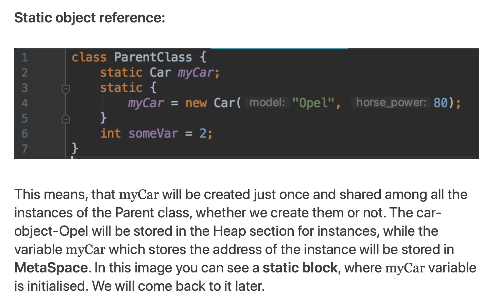

## static 객체 메모리 적재

다음과 같은 static 객체가 있을 때, 메모리에 어떻게 적재되는지 궁금해서 찾아보았다. 구체적인 내용은 블로그에 포스팅 하기로 하자.

```java
class Money {
    static Currency currency = new Currency()
}
```

위 코드에서 보면 Currency 타입의 static 변수가 정의되어 있다. static 변수 또는 메소드는 클래스영역에 적재되는 것으로 알고 있는데, new 연산자를 이용해 생성한 인스턴스도 클래스영역에 적재되는 걸까? 찾아봤더니 그게 아니라는 것을 알 수 있었다.

참조변수 `Currency currency`는 클래스영역에 적재되고, `new Currency()`에 의해 생성된 인스턴스는 힙영역에 적재된다. 힙영역에 적재된 인스턴스 중 더이상 참조되지 않는 인스턴스는 GC 대상이 되지만, static 영역에 올라간 참조변수가 프로세스가 종료될 때까지 Currency 인스턴스를 참조하기 때문에 GC 대상이 되지 않는 것이다.

<div align="center">
    
    <p>
        <a href="https://www.linkedin.com/pulse/static-variables-methods-java-where-jvm-stores-them-kotlin-malisciuc">< 링크드인 블로그 참고 (java static vs kotlin companion object ></a>
    </p>
</div>
