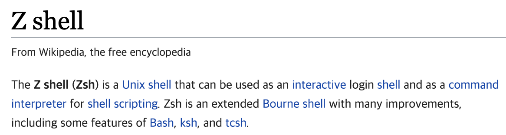
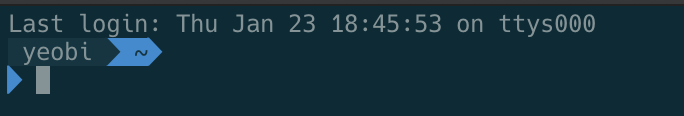
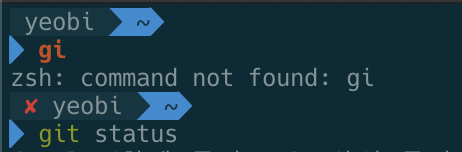
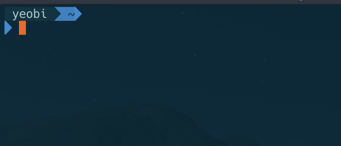

## Mac 터미널 꾸미기

### zsh 설치



z shell 이라고도 한다. bash와 같은 쉘 인터페이스이다. bash 보다 확장된 기능을 가지고 있다.

```shell
# zsh 설치하기
$ brew install zsh

# zsh 설치 결과
ncurses is keg-only, which means it was not symlinked into /usr/local,
because macOS already provides this software and installing another version in
parallel can cause all kinds of trouble.

If you need to have ncurses first in your PATH run:
  echo 'export PATH="/usr/local/opt/ncurses/bin:$PATH"' >> ~/.zshrc

For compilers to find ncurses you may need to set:
  export LDFLAGS="-L/usr/local/opt/ncurses/lib"
  export CPPFLAGS="-I/usr/local/opt/ncurses/include"
```


### Oh my zsh 설치


```shell
# oh my zsh 설치
$ sh -c "$(curl -fsSL https://raw.github.com/robbyrussell/oh-my-zsh/master/tools/install.sh)"

# oh my zsh 설치 결과
Looking for an existing zsh config...
Found ~/.zshrc. Backing up to /Users/yeobi/.zshrc.pre-oh-my-zsh
Using the Oh My Zsh template file and adding it to ~/.zshrc.

         __                                     __
  ____  / /_     ____ ___  __  __   ____  _____/ /_
 / __ \/ __ \   / __ `__ \/ / / /  /_  / / ___/ __ \
/ /_/ / / / /  / / / / / / /_/ /    / /_(__  ) / / /
\____/_/ /_/  /_/ /_/ /_/\__, /    /___/____/_/ /_/
                        /____/                       ....is now installed!


Please look over the ~/.zshrc file to select plugins, themes, and options.

p.s. Follow us on https://twitter.com/ohmyzsh

p.p.s. Get stickers, shirts, and coffee mugs at https://shop.planetargon.com/collections/oh-my-zsh
```


### agnoster 테마 설치

현재 디렉토리에서 Git 상태 확인 가능하다. 현재 checkout된 브랜치 알 수 있다.

```shell
$ vi ~/.zshrc
```

.zshrc 파일의 테마 값을 agnoster로 변경해준다.

```
# .zshrc 파일 내부

# ZSH_THEME="robbyrussell"
ZSH_THEME="agnoster"
```

.zshrc 파일 적용

```shell
$ source ~/.zshrc
```


### User 영역 깔끔하게 처리

.zshrc 파일을 다시 수정한다. 맨 아래 부분에 추가한다.

```
# .zshrc 파일 내부

prompt_context() {
  if [[ "$USER" != "$DEFAULT_USER" || -n "$SSH_CLIENT" ]]; then
    prompt_segment black default "%(!.%.)$USER"
  fi
}
```


### 개행 적용하기

agnoster.zsh-theme 파일 수정

```shell
$ vi ~/.oh-my-zsh/themes/agnoster.zsh-theme
```

```shell
# agnoster.zsh-theme 파일 

# build_prompt() 부분에 prompt_newline 입력
build_prompt() {
  RETVAL=$?
  prompt_status
  prompt_virtualenv
  prompt_context
  prompt_dir
  prompt_git
  prompt_bzr
  prompt_hg
  prompt_newline # 해당 내용을 추가한다. (순서 중요)
  prompt_end
}

# 아래 함수를 추가해준다.
prompt_newline() {
  if [[ -n $CURRENT_BG ]]; then
    echo -n "%{%k%F{$CURRENT_BG}%}$SEGMENT_SEPARATOR
%{%k%F{blue}%}$SEGMENT_SEPARATOR"
  else
    echo -n "%"
  fi

  echo -n "%"
  CURRENT_BG=''
}
```



### 하이라이트 적용하기

사용 가능한 명령 하이라이트 표시

```shell
# 플러그인 설치
$ brew install zsh-syntax-highlighting

# 플러그인 적용
$ vi ~/.zshrc

# .zshrc 파일 하단에 아래 내용을 추가한다.
source /usr/local/share/zsh-syntax-highlighting/zsh-syntax-highlighting.zsh
```



완성된 터미널 

- 투명 적용
- Solarized Dark Higher Contrast 테마 적용
- [iTerm 테마 다운](https://github.com/mbadolato/iTerm2-Color-Schemes#installation-instructions)


