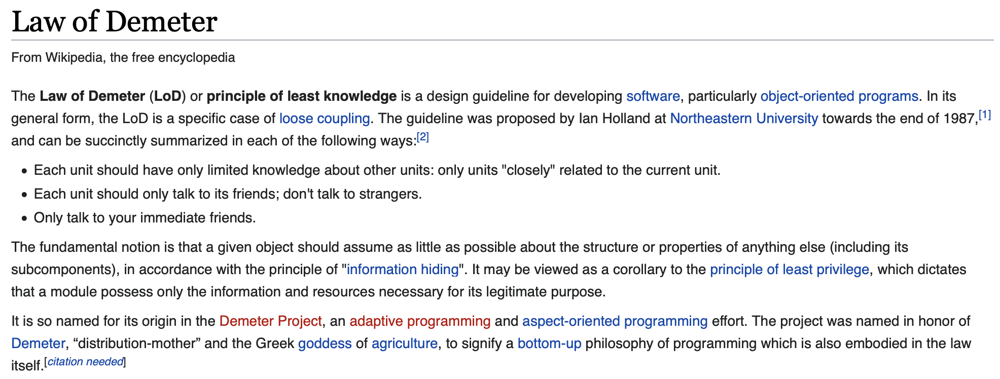

## 캡슐화 (encapsulation)

객체 지향에서 캡슐화를 이용해 한 곳의 변경이 다른 곳에 영향을 미치지 않도록 설계해야 한다. 캡슐화란 내부 구현을 감추고 외부에 제공하는 기능만을 공개하는 것이다.

- **Tell, Don't Ask**
    - 데이터를 가져와서 직접 처리하지 않는다. 처리를 다른 객체에게 요청한다. 다른 객체에게 데이터를 물어보지 않고 기능 실행을 요청한다. 
    - 데이터를 중심으로 프로그래밍 하는 것은 절차지향적인 방법이다.
- **데미테르의 법칙 (Law of Demeter)**
    
    
    
    - 메서드에서 생성한 객체의 메서드만 호출
    - 파라미터로 받은 객체의 메서드만 호출
    - 필드로 참조하는 객체의 메서드만 호출
