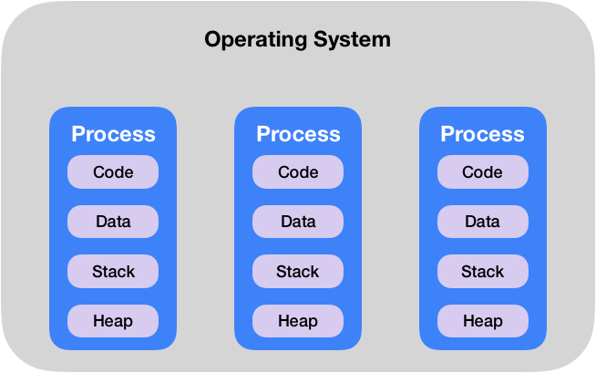
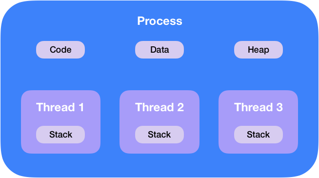

# 프로세스와 스레드

> 프로세스는 운영체제로부터 자원을 할당 받는 `작업의 단위`이다.
>
> 스레드는 프로세스가 할당받은 자원을 이용하는 `실행의 단위`이다.

## 프로그램 (Program)

    
    

        <a href="https://ko.wikipedia.org/wiki/%ED%94%84%EB%A1%9C%EA%B7%B8%EB%9E%A8">위키피디아</a>
    

- 디스크에 저장되어 있는 물리적인 파일.
- 어떤 작업을 위해 실행할 수 있는 파일.

 

## 프로세스 (Process)

    
    

        <a href="https://ko.wikipedia.org/wiki/%ED%94%84%EB%A1%9C%EC%84%B8%EC%8A%A4">위키피디아</a>
    

    

- 운영체제로부터 시스템 자원을 할당 받는 `작업의 단위`이다.
- 메모리에 올라와 실행중인 프로그램을 의미한다.
- 기본적으로 프로세스당 최소 1개의 스레드(메인 스레드)를 가지고 있다.
- 프로세스는 각각 독립된 메모리 영역(Code, Data, Stack, Heap)을 할당 받는다.
- 각 프로세스는 별도의 주소 공간에서 실행되며, 한 프로세스는 다른 프로세스의 변수나 자료구조에 접근할 수 없다.
- 하나의 프로세스가 다른 프로세스의 자원을 직접 접근할 수 없다. IPC, Shared memory 등 프로세스 간의 통신을 통해 데이터를 주고받을 수 있다.

 

## 스레드 (Thread)

    
    

        <a href="https://ko.wikipedia.org/wiki/%EC%8A%A4%EB%A0%88%EB%93%9C_(%EC%BB%B4%ED%93%A8%ED%8C%85)">위키피디아</a>
    

    

- 프로세스가 할당받은 자원을 이용하는 `실행의 단위` 이다.
- 스레드는 프로세스 내에서 각각 Stack만 따로 할당 받고 `Code, Data, Heap 영역은 공유`한다.
- 스레드는 한 프로세스 내에서 동작되는 여러 실행의 흐름으로, 프로세스 내의 주소 공간이나 자원들(Heap 공간)을 같은 프로세스 내에 스레드끼리 공유하면서 실행된다.
- 각각의 스레드는 별도의 Register와 Stack을 갖고 있지만, Heap 메모리는 서로 읽고 쓸 수 있다.
- `한 스레드가 프로세스 자원을 변경하면, 다른 이웃 스레드도 그 변경 결과를 즉시 볼 수` 있다. (스레드간 자원의 공유 => 멀티 스레드 환경에서 문제 발생할 여지가 있다.)
